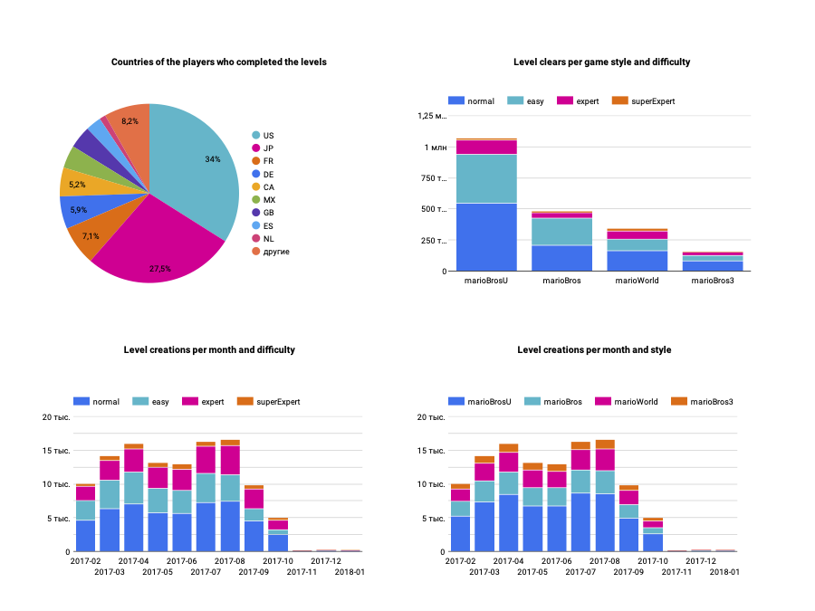

## About dataset

**Super Mario Maker**  is a 2015 side-scrolling platform game and game creation system developed and published by Nintendo for the Wii U released worldwide in September 2015. Players can create, play, and share courses online, free of charge, based on the styles of **Super Mario Bros.**, **Super Mario Bros. 3**, **Super Mario World**, and **New Super Mario Bros. U** (from [wikipedia](https://en.wikipedia.org/wiki/Super_Mario_Maker))

My goal is to get information about player preferences for level difficulty and gamestyles, as well as popularity this game in different countries. 
I used SMM dataset from [kaggle.com](https://www.kaggle.com/datasets/leomauro/smmnet). 

**Warning**: this dataset is not complete, so it does not allow me to get complete information about the game. But it does allow me to get the information I'm interested in.

## Tools & Technology

 -   Terraform (IaC)
 -   Cloud: Google Cloud Platform (GCP)
    -   Data Lake: Google Cloud Storage (GCS)
    -   Data Warehouse: Google Big Query (GBQ)
    -   Data Visualization: Google Looker Studio 
 -   Orchestration: Prefect
 -   Data Transformation:dbt
 -   Scripting Language: Python
 
## Data Pipeline 

-    **01_extract_load**
	 - download data in csv format
	 - save data local in parquet format
	 - upload data to gcloud
	 - create external tables

-   **02_dbt_run**
	 - create staging tables
	 - create data marts (as partitioned and clustered tables)

## Project pre-requisites

1.  **gcloud account** with a configured **billing account**
2.  **gcloud client** installed on your computer.
3. **ssh client** installed on your computer

## Auto-configuration and run

If you have a macOS, you can configure cloud infrastructure automatically:

-  Clone this project
	`git clone https://github.com/svetlanakononova/smm-analyze.git`
	`cd smm-analyze`
-  Edit *config_google_clouds.sh*.  Change parameters:
	-  ACCOUNT_ID=<google_account> 
 	- BILLING_ACCOUNT_ID=<billing_account_id>
 	- VM_USER_NAME=<your_username> 
 Note: you can find your billing account id in [Billing Menu](https://console.cloud.google.com/billing) 

-  Configure gcloud
	`./config_google_clouds.sh`  
-  Copy nessesary files to VM
	`./copy_files_to_vm.sh` 

-  Running project
  `ssh smm-project-vm`
  `./install_and_run.sh`

## Manual setup and run

-  Сreate Google Cloud project named **smm-analyze_prj**
 
-  Create a Service Account:

	-  Go to IAM & Admin > Service Accounts
	-  Create Service Account named **smm-analyze-adm**. 
	-  Add the following roles to the service account:
		-  Viewer
		-  Storage Admin
		-  Storage Object Admin
		-  BigQuery Admin
	-  Download the private JSON keyfile. Rename it to google_creds.json and store it in ${HOME}/.google/creds/
	-  You would need to enable this APIs if you have not done already
		-  [IAM API](https://console.cloud.google.com/apis/library/iam.googleapis.com)
		-  [IAM Service Account Credentials API](https://console.cloud.google.com/apis/library/iamcredentials.googleapis.com)

-  Setting up a Virtual Machine on GCP
	-  On the project dashboard, go to Compute Engine > VM Instances
	-  Create a new instance named **smm-project-vm**
	-  Choose **europe-west1-b** region 
	-  For machine configuration, choose  **e2-standard-2**. 
	-  In the Boot disk section, change it to **Ubuntu**,  **Ubuntu 22.04 LTS x86/64, amd64 jammy image built on 2023-03-02, supports Shielded VM features**.
	-  Set disk size to 30GB.
	-  Leave all other settings on default value and click Create
-  Setting up a VM for ssh connection
	-  Сreate the SSH key:
		`ssh-keygen -t rsa -f ~/.ssh/gckey -b 2048 -N "" -C <your_user_name>`
	
	-  On the GCP dashboard:
		-   Navigate to Compute Engine > Metadata > SSH KEYS
		-  Click Edit.
		-  Click Add Item. 
		-  Paste the public key (from ~/.ssh/gckey.pub)
		-  Click Save

	-  Go to the VM instance you created and copy the External IP.
	-  Create file *~/.ssh/config* with the following content
			
			Host smm-project-vm  
    		HostName <External IP>
    		User <your_user_name>
    		IdentityFile ~/.ssh/gckey

		If this file already exists just add these lines to the end.

	- Copy gcloud creds file to VM:
		`scp  ~/.google/creds/google_creds.json smm-project-vm:.gc`

-  Connect to VM:
	`ssh smm-project-vm`

-  Install git 
	`sudo apt update && sudo apt-get -y install git nano`

-  Clone this project
	`git clone https://github.com/svetlanakononova/smm-analyze.git`

-  Run installation and running process
	`cd smm-analyze`
	`./install_and_run.sh`

**Note**:
When the data is proceed, you will see the message 
`INFO prefect.infrastructure.process - Process '*******' exited cleanly `

## Dashboard

